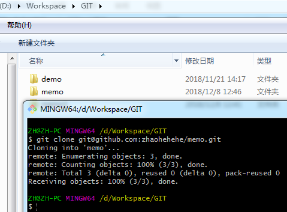
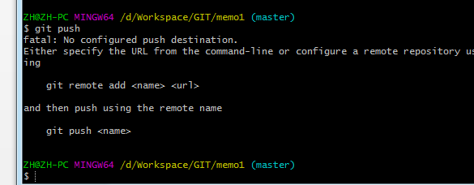
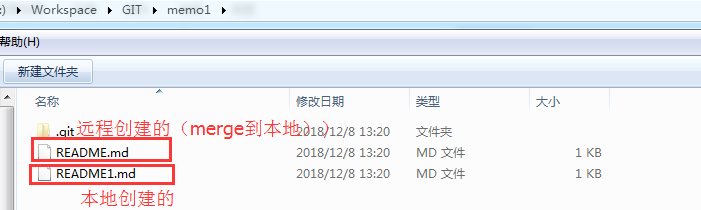

### 生成SSH Key

1.	配置git
   git config --global user.name "zhaohe"
   git config --global user.email "zhaohe@localhost"
2.	查看是否有密钥文件
        ls -al ~/.ssh/
3.	ssh-keygen -C 'zhaohe@localhost' -t rsa 生成密钥
4.	到github上面添加生成的id_rsa.pub文件内容即可。

### 拉取github仓库到本地

1. 在github上新建仓库memo

2. clone远程仓库

   

3. 新增/删除文件夹Maven
   (1)    $ cd memo
   (2)	尚未暂存以备提交的变更:

   ​		更新要提交的内容:$ git add Maven/*( git add . 命令上传所有文件)	

   ​		丢弃工作区的改动:$ git checkout -- <文件>...

   (3)    $ git commit -m '添加Maven pom文件配置'(提交到本地版本控制)
   (4)	$ git pull(拉取，解决冲突)
   (5)	$ git push(上传到远程仓库)

4. $git  rm –rf --cached Maven/**（git  rm –rf --cached . 指的是所有文件）

   ​	①-r:用来删除目录；

   ​	②git rm –-cached a.txt ：文件退出版本控制。删除的是本地仓库中的文件，但是本地工作区中的文件会保留，不再与远程仓库发生跟踪关系；
   ​	③git rm a.txt ：删除本地工作区中的文件，并且会进行版本跟踪；

5. 查看仓库信息：
   $ git remote -v
   origin  git@github.com:zhaohehehe/memo.git (fetch)(从远程fetch到本地)
   origin  git@github.com:zhaohehehe/memo.git (push) (从本地push到远程)
6. 查看状态： $ git status

### 上传本地仓库到github

1. 在本地新建仓库，上传到github:$ git init

2. 新增文件README1.md,执行 $ git add .

3. $ git commit -m 'add file'

4. $ git push 报错（因为没有关联远程仓库）：

   

5. 关联github远程仓库
   - 登录github,在github上新建一个仓库memo1(git@github.com:zhaohehehe/memo1.git)
   - 然后本地执行以下命令关联：
     $ git remote add origin git@github.com:zhaohehehe/memo1.git

### 代码合并

1.  $ git pull进行代码合并【注：pull=fetch+merge]

   执行$ git pull命令不会将远程代码和本地代码合（并不会将远程的代码拉取到本地，及本地仍然只有README1.md一个文件）

   那怎么合并呢？

   可以执行$ git pull --rebase origin master，这样本地文件夹就会新增README.md文件，成功合并（此时本地会有2个文件）

   

2. 上传本地代码

   注意：git push命令会上传失败，因为git本地新建一个分支后，必须要做远程分支关联。如果没有关联， git 会在下面的操作中提示你显示的添加关联。关联目的是如果在本地分支下操作： git pull, git push ，不需要指定在命令行指定远程的分支． 推送到远程分支后， 你只要没有显示指定， git pull 的时候，就会给出提示。

    

   如果不set关联，只需要执行一次完整命令$ git push -u origin master（或者$  git push --set-upstream origin master）即可，以后都不需要执行仓库，即执行git push即可。

### 放弃本地修改

1. 已经加入git index,但是未使用 git add 缓存

   可以使用 git checkout -- filepathname (比如： git checkout -- readme.md  )。放弃所有的文件修改可以使用 git checkout .  命令。

   此命令用来放弃掉所有还没有加入到缓存区（就是 git add 命令）的修改：内容修改与整个文件删除。但是此命令不会删除掉刚新建的文件。因为刚新建的文件还没已有加入到 git index 的管理系统中。

2. 已经使用  git add （未验证）

   可以使用  git reset HEAD filepathname （比如： git reset HEAD readme.md）来放弃指定文件的缓存，放弃所有缓存可以使用 git reset HEAD . 命令。

   此命令用来清除 git  对于文件修改的缓存。相当于撤销 git add 命令所在的工作。**在使用本命令后，本地的修改并不会消失**，而是回到了如（一）所示的状态。继续用（一）中的操作，就可以放弃本地的修改。

3. 已经用 git commit  提交了代码（未验证）

   可以使用 git reset --hard HEAD 来回退到上一次commit的状态。此命令可以用来回退到任意版本：git reset --hard  commitid 

   注意：使用 git log 命令来查看git的提交历史。

 

### 分支

1.  查看分支：git branch -a
2. 在当前分支创建新分支：git branch 分支名称
3. 切换分支：git checkout 分支名称
4. 在当前分支创建分支并切换（2+3）：git checkout -b 创建分支名称 
5. push新分支：git push origin  分支名称
6. 删除远程分支：git push origin --delete 分支名称
7. 修改当前分支名称：git branch -m oldBranchName newBranchName
8. 删除本地分支：git branch -d 分支名称