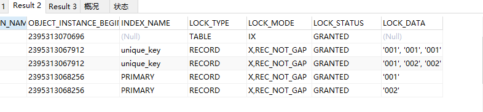
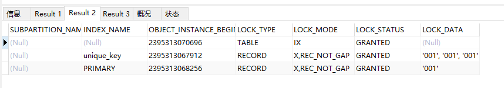
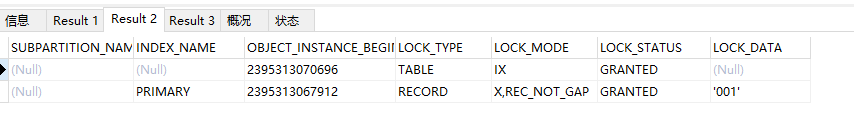
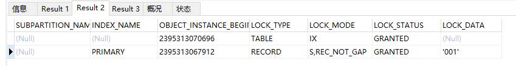
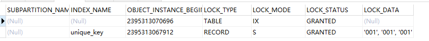
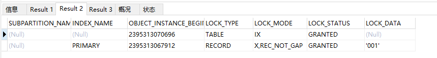
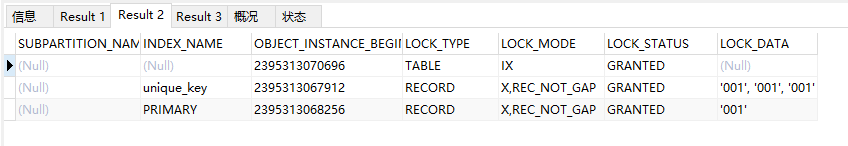
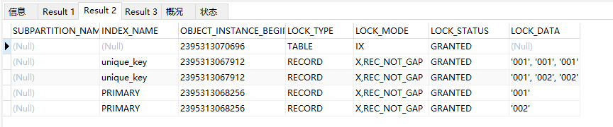

# 条件：RC

INSERT INTO `lock_test`(`id`, `u_1`, `u_2`, `key`) VALUES ('001', '001', '001', '001');
INSERT INTO `lock_test`(`id`, `u_1`, `u_2`, `key`) VALUES ('002', '001', '002', '002');
INSERT INTO `lock_test`(`id`, `u_1`, `u_2`, `key`) VALUES ('005', '005', '005', '005');
INSERT INTO `lock_test`(`id`, `u_1`, `u_2`, `key`) VALUES ('009', '009', '009', '009');

#### select--------------------------------------------------------------------------------------------------------------

1. where 多列唯一性索引之一：
   select * from lock_test where u_1 = '001' for update;（如果不存在：只在表上加IX锁）

2. where 多列唯一性索引：
   select * from lock_test where u_1 = '001' and u_2 = '001' for update;(如果不存在：只在表上加IX锁)

3. where 主键：

   select * from lock_test where id = '001' for update;(如果不存在：只在表上加IX锁)

   

#### insert--------------------------------------------------------------------------------------------------------------

1. insert 主键冲突：

   insert into lock_test(id,u_1,u_2,`key`) values ('001','001','001','001');(如果不冲突：只在表上加IX锁)

   

2. insert 唯一性索引冲突：

   insert into lock_test(id,u_1,u_2,`key`) values ('999','001','001','001');(如果不冲突：只在表上加IX锁)

   

#### delete--------------------------------------------------------------------------------------------------------------

1. delete where = 主键：

   delete from lock_test where id = '001';

   delete from lock_test where id = '001' and u_1 = '001' and u_2 = '001';

   

2. delete where = 多列唯一性索引

   delete from lock_test where u_1 = '001' and u_2 = '001';

   

3. delete where = 多列唯一性索引之一

   delete from lock_test where u_1 = '001';

   

