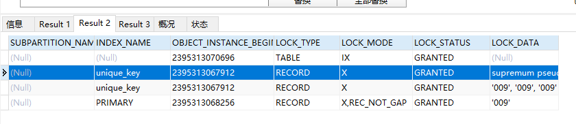
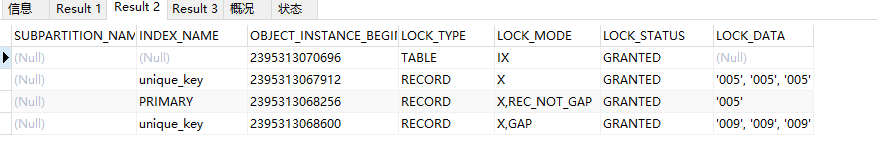
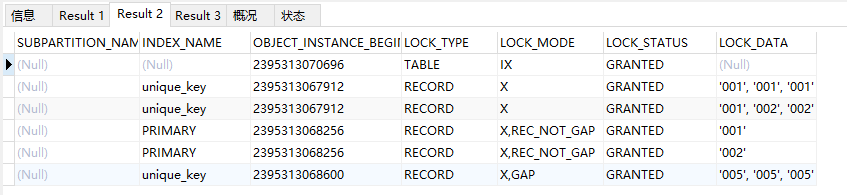
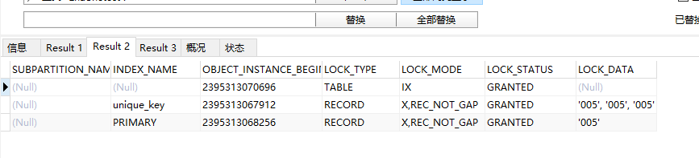
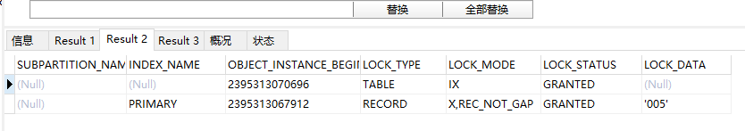
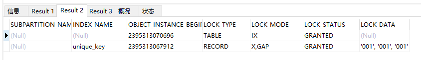
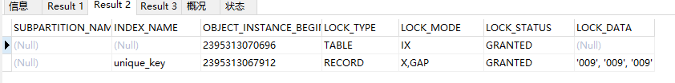

# 条件：RR

INSERT INTO `lock_test`(`id`, `u_1`, `u_2`, `key`) VALUES ('001', '001', '001', '001');
INSERT INTO `lock_test`(`id`, `u_1`, `u_2`, `key`) VALUES ('002', '001', '002', '002');
INSERT INTO `lock_test`(`id`, `u_1`, `u_2`, `key`) VALUES ('005', '005', '005', '005');
INSERT INTO `lock_test`(`id`, `u_1`, `u_2`, `key`) VALUES ('009', '009', '009', '009');

#### select--------------------------------------------------------------------------------------------------------------

1. where 多列唯一性索引（存在）：
   select * from lock_test where u_1 = '009' for update;

​		select * from lock_test where u_1 = '005' for update;

​		

​		select * from lock_test where u_1 = '001' for update;

​		

select * from lock_test where u_1 = '005' and u_2 = '005' for update;

select * from lock_test where id = '005'  for update;

select * from lock_test where id = '005' and u_1 = '005' and u_2 = '005' for update;

2. where 多列唯一性索引（不存在）：
   select * from lock_test where u_1 = '000' for update;

   

   select * from lock_test where u_1 = '006' for update;

   select * from lock_test where u_1 = '006' and u_2 = '000' for update;
   
   
   
   select * from lock_test where id= '000' for update;
   
   
   
   select * from lock_test where id= '001' and u_1 = '006' and u_2 = '000'  for update;
   
   